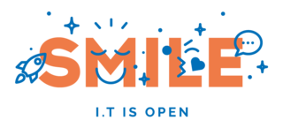

[](https://github.com/Smile-SA/Onestock/pulls)
 

<p align="center">
    
</p>

##  Magento Version Compatibility

This module was created for Magento **2.4.x** Opensource (CE) / Adobe Commerce (EE)  

##  Installation

```composer require smile/onestock```

##  Documentation

- [Order Orchestration](./src/module-onestock-connector/README.md)
- [Delivery Promise](./src/module-onestock-deliverypromise/README.md)


## Standards & Code Quality

Built on top of Magento2, our module respects all its prerequisites and code quality rules.

## Who is developing this module ?

Smile is the **European leader of Open Source** and also a four-times **Europe Partner of the the Year** (2010-2014), two-times **Spirit of Excellence** (2015-2016), **Global Elite Partner** (2017-now), and **Regional Commercial Partner** (2018) awarded by Magento.
<p align="center">
    <a href="http://www.smile.eu"></a>
</p>
Our multidisciplinary team brings together experts in technology, innovation, and new applications.

Together we explore, invent, and test technologies of the future, to better serve our clients.